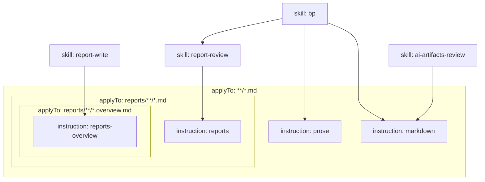

# Railing

Engineering guardrails that keep AI coding agents on track.

## Contents

```text
├── plugin.json                                  plugin name, version, description, Agent Plugins schema
├── com.github.copilot/                          the only directory where VS Code reads rules and agents
│   ├── agents/
│   │   ├── engineering-maturity.agent.md        engineering maturity advisor
│   │   ├── gilfoyle.agent.md                    blunt code review and analysis
│   │   ├── report-reviewer.agent.md             review reports against the code
│   │   └── report-writer.agent.md               write technical reports about existing code
│   └── rules/
│       ├── global.instructions.md               general agent behavior and workflow guidance
│       ├── global-code.instructions.md          shared coding principles for C++, Python, JavaScript, TypeScript
│       ├── api-cpp.instructions.md              C++ API development guidance
│       ├── api-python.instructions.md           Python API development guidance
│       ├── markdown.instructions.md             formatting checks for all *.md files
│       ├── prose.instructions.md                how developer-facing prose reads, in all *.md files
│       ├── reports.instructions.md              universal requirements for agent-written reports in reports/
│       └── reports-overview.instructions.md     structure and checks for *.overview.md reports
└── skills/
    ├── ai-artifacts-review/                     audit AI configuration artifacts
    ├── bp/                                      validate files against best-practice references
    ├── debug-context-artifacts/                 inspect the initial AI context state
    ├── design-system/                           create or audit design systems
    ├── migration-skill-factory/                 create skills for codebase migrations
    ├── reflect/                                 propose context improvements after a task
    ├── report-review/                           clean up a report and verify it against the code
    ├── report-write/                            write a technical report about existing code into reports/
    └── to-issues/                               convert plans and discussions into tracker issues
```

## File links

Which skills depend on which instructions and skills. An arrow means "links to". Instructions do not depend on each other; the frames show the `applyTo` scope in which each attaches.


