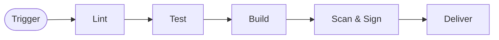
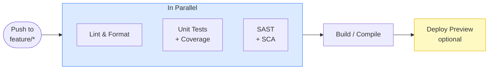
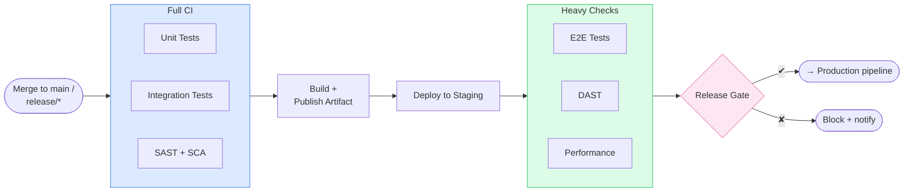

# CI/CD Pipeline Best Practices Guide

## About This Guide

This guide is not tool documentation or a collection of ready-made configs.
It's about **CI/CD pipeline design principles**: why they're structured this way,
how to adapt verification depth to context, and how to avoid security theater instead of real protection.

Audience: developers, DevOps engineers, tech leads - anyone who designs or improves pipelines.

## Terms

IaC - Infrastructure as Code
DAG - directed acyclic graph
Step - individual command or action executed sequentially within a job (e.g., "run tests", "compile code")
Job - unit of work executed on a single runner and can be parallelized with other jobs
Workflow - DAG with jobs as vertices, describing their execution sequence and dependencies

## General Best Practices

### Pipeline Speed

Since a pipeline can fail at any stage, it's important to put the fastest checks
with high probability of failure early in the pipeline

- Fail Fast - if dependencies allow, fast checks come first in the pipeline, then slower ones
- Parallelism - independent stages with comparable execution time should run in parallel
- Timeouts - each stage has a hard timeout. A hung job shouldn't block the pipeline for hours

### Stability and Reproducibility

- Pipeline as Code - pipeline is stored and versioned in the same repository as code
- Idempotency - re-running a pipeline should produce the same result.
- Hermetic builds - build is *reliably* isolated, not just pinned. Check for unpinned deps, timestamps in artifacts, env variables affecting build output, network calls during build
- Caching - dependencies are cached by key (lock file hash). Invalidation on any dependency change.
- No Snowflake runners - all runners are identical and deployed via IaC, no manual tweaks.
- Immutable infrastructure - infrastructure (staging/prod) are not modified manually, all changes through code and pipeline.
- Forbid manual changes - if a manual change of infrastructure found, it should be alerted and reverted to IaC state automatically.
- Reproducible artifacts - bit-identical invariant at the CI level: building from the same commit always produces the same artifact. This exact artifact is deployed to staging/prod without rebuilding or modifications. This is the foundation of deployment trust.
- Env isolated artifacts - changes to the build environment should not affect the artifact

### Testing

- Tests don't depend on execution order or external services (mock/stub). Randomizing order helps reveal hidden dependencies.
- Follow Test Pyramid: many unit → fewer integration → few E2E.
- Code coverage threshold (coverage gate) - 80–85%; higher doesn't make sense for most projects.
- Environment Parity - staging is as close as possible to prod in configuration, data, and infrastructure.

### Dependency Management

- Pinned deps - all project dependencies (including transitive) must be pinned in lock files.
- Pinned OS deps - all OS dependencies (libraries, runtime) must be pinned in Dockerfile or similar.
- Automatic PRs for dependency updates (Renovate, Dependabot): auto-merge for `patch`, manual approval for `minor`/`major`
- SCA on every PR, not just on schedule - new CVEs appear at any time

### Security

- Secrets only through secret manager (Vault, AWS Secrets Manager, GitHub Secrets). Never in code.
- Branch protection - merge to `main`/`release/*` only through PR with mandatory CI passing.
- No CI bypasses - hotfixes also go through the pipeline; speed comes from fast CI, not skipping it.
- SAST - on every PR.
- Docker image scanning (Trivy, Grype) before publishing.
- Least privilege - CI runner has minimal permissions; separate roles for staging and prod.
- Artifact signing (Cosign, Sigstore).

### Deployment Reliability

- Deployment strategies: Blue-Green, Canary, Rolling Update - not `stop-start` in prod.
- Feature flags as a control mechanism, not a deployment replacement.
- Automatic rollback based on metrics (error rate, latency spike).
- Deploy to prod only from protected branches (`main`, `release/*`).
- One artifact - image built in CI is deployed to both staging and prod without rebuilding.

### Observability

- DORA metrics: Deployment Frequency, Lead Time, MTTR, Change Failure Rate.
- Deployment version is visible in monitoring (Grafana annotations, Datadog deployment markers).
- Notification routing - feature branch failures notify only the PR author; `main`/`release` failures notify the entire team.

---

### Default Pipeline and Its Modifications

Here's an approximate schema of stages that can be in a CI/CD pipeline.
They can be refined and parallelized within a specific stage, but the general structure is usually preserved:
*Stages are already ordered by Fail Fast principle

| Stage        | Question                               | Typical Tools                      | Cost    |
|--------------|----------------------------------------|------------------------------------|---------|
| Lint         | Is code valid? (syntax, style, types)  | lint, format, type check           | seconds |
| Test         | Is code correct and secure?            | unit tests, integration, SAST, SCA | minutes |
| Build        | Is artifact created and packaged?      | compile, docker build, bundle      | minutes |
| Scan & Sign  | Does artifact contain CVE and signed?  | Trivy, Grype, Cosign, SBOM         | minutes |
| Deliver      | Does it work in production?            | deploy → smoke → monitor           | hours   |



There are 2 important groups of reasons that can significantly affect how the pipeline structure changes from the universal default:

Project/artifact type:

- Infrastructure / IaC - declarative infrastructure description (Terraform, Docker, Ansible, etc.)
- Backend - server services and APIs (REST, gRPC, GraphQL, worker processes)
- Frontend - web applications (React, Angular, etc.)
- Library / Package / SDK - reusable code published to a package manager (npm, PyPI, Maven Central)
- App - native application published to app stores (App Store, Google Play, Steam, Microsoft Store)

Pipeline trigger purpose:

`PR validation` - typically triggered by push to feature branch when PR is open.
Goal - quick feedback on code quality before merge to dev/main branch

`Release / Publish` - runs on merge to protected branch (`release/*`) or tag push.
Goal - create versioned artifact, verify in staging, and deliver to prod/package manager/store

`Scheduled / Bot trigger` - runs on schedule without git event binding.
Goal - regular checks not needed on every commit, but important for maintaining quality and security

`Manual` - run by operator on explicit request.
Goal - emergency operations (hotfix, rollback) or heavy checks on demand (tests, deploy specific tag)

In `Scheduled / Bot trigger` and `Manual` there can be the most significant deviations from the default pipeline.

### Types of Testing

- Unit Tests - module tests: isolated logic of a single function/class without external dependencies
- Integration Tests - tests of interaction between multiple components (DB, queue, external service via container)
- E2E Tests - end-to-end tests: complete user scenario through real UI or API gateway
- Smoke Tests - smoke tests: minimal set of checks "service is alive and responding" - quick, no depth
- Contract Tests - contract tests: API compatibility between producer and consumer (Pact, Spring Contract)
- Performance / Load Tests - load tests: throughput, latency percentiles, behavior under load
- Visual Regression Tests - visual regression tests: pixel/DOM diffs of page screenshots between versions
- SAST (Static Application Security Testing) - vulnerabilities in source code without running it (SQL injection, hardcoded secrets)
- DAST (Dynamic Application Security Testing) - vulnerabilities in running application via HTTP attacks (OWASP ZAP, Nuclei)

### Deployment Strategies

- Recreate - stops old version, then starts new. Simple, but causes downtime.
- Rolling Update - gradually replaces old version instances with new ones (one at a time or in batches). No downtime, native in Kubernetes, but two versions simultaneously in prod - backward compatibility needed.
- Blue-Green - keeps two identical environments (Blue = current prod, Green = new version), switching via router/LB change. Instant rollback, but double resources and complex DB synchronization.
- Canary - new version receives small traffic portion (1–10%), portion grows with healthy metrics. Minimal blast radius, but harder to observe - smart metrics needed.
- Feature Flag - code is deployed, but feature is hidden behind flag, enabled without deployment. Separates deployment and release, but flags accumulate as technical debt.

### DORA Metrics

DORA (DevOps Research and Assessment) - four metrics measuring engineering delivery effectiveness. Measured at team/product level, not at individual pipeline level.

- Deployment Frequency - how often the team deploys to prod (`number_of_deployments / period`)
- Lead Time for Changes - time from commit to working code in prod (`merge_timestamp − first_commit_timestamp`)
- MTTR (Mean Time To Restore) - average recovery time after incident (`sum(restore_time) / incidents`)
- Change Failure Rate - fraction of deployments leading to incident/rollback (`failures / total_deployments`)

> **How to use:** DORA metrics are not competitive comparison - it's diagnostics. Low Deployment Frequency with high Lead Time indicates large change batches → need to break them down. High Change Failure Rate with high frequency → need stricter gate before prod.

### Versioning Best Practices

#### Semantic Versioning (SemVer) - for libraries, SDKs, CLIs, Marketplace Apps

```plaintext
MAJOR.MINOR.PATCH[-pre_release][+build_metadata]
  1  .  4  .  2  -  rc.1      + git.a3f9c12
```

| Component      | When to Increment                                 |
|-------         |------------------------                           |
| `MAJOR`        | Backward incompatible API change                  |
| `MINOR`        | New functionality added, compatibility maintained |
| `PATCH`        | Bug fix, compatibility maintained                 |
| `-pre_release` | `alpha`, `beta`, `rc.1` - unstable version        |

**In CI:** git tag `v1.4.2` → pipeline trigger → version extracted from tag automatically.

```bash
# Example: version from git tag
VERSION=$(git describe --tags --abbrev=0)   # → v1.4.2
VERSION=${VERSION#v}                         # → 1.4.2
```

#### Calendar Versioning (CalVer) - for services, OS, data pipelines

```plaintext
YYYY.MM.DD[-build_number]
2026.05.15-42
```

Suitable when "version" is less important than release date (Ubuntu, Grafana, pip).

#### Image Tagging - for Docker

Never deploy `:latest` to production.

```plaintext
registry.io/myapp:1.4.2           # SemVer tag - for prod
registry.io/myapp:1.4.2-rc.1      # Release candidate - for staging
registry.io/myapp:main-a3f9c12    # Branch + short SHA - for dev/preview
registry.io/myapp:pr-247          # PR preview
```

**Rule:** image deployed in prod must be **immutable** - the same tag cannot be rebuilt with different content. Tag = promise, not pointer.

#### API Versioning

```plaintext
/api/v1/users    ← stable, don't break
/api/v2/users    ← new contract
/api/beta/users  ← experimental, no guarantees
```

Version in URL - for REST. For GraphQL and gRPC - other mechanisms (field deprecation, backward-compatible schema evolution).

---

## Feature Branch vs Release Branch Pipeline

### Design Principles

Main question: **"What do we need to know at this stage, and how expensive is it to find out later?"**

Feature branch - experimental space. Developer should get fast feedback on code quality. Pipeline here serves as a **developer tool**, not an organizational control point. Therefore: only fast checks (< 10 min), high parallelism, no deployments to long-lived environments.

Release branch (or `main` after merge) - **trust point**. Code passed review and will be delivered to users. Here everything expensive to run on every commit is appropriate: full test suites, staging deployments, security scanning of running service, approvals.

### Feature Branch Pipeline (with PR)

**Goal: fast feedback to developer.** Should complete in 5–15 minutes.



**Include:**

- Lint, format check (fail fast on style)
- Unit tests + coverage gate
- SAST and SCA (dependency scan) - vulnerabilities visible before merge
- Build/compile - ensure code compiles
- Deploy Preview (Vercel, Netlify, ephemeral namespace) - only if visual verification needed

**Don't Include:**

- Integration and E2E tests - they're slow; if needed, trigger by label (`/run-e2e` in comment)
- DAST - doesn't make sense without stable deployed environment
- Performance tests
- Deploy to long-lived staging

**Why:** feature branch can be created and deleted dozens of times a day. Heavy checks here create noise, slow development, and waste resources.

### Release Branch Pipeline (merge to `main` or `release/*`)

**Goal: controlled, verified delivery.** Speed is secondary to confidence.



Include:

- Everything from feature branch pipeline
- Integration tests (with real dependencies in containers)
- Artifact publishing to registry (with version from tag/SHA)
- Deploy to staging
- E2E tests, DAST, performance tests against deployed staging
- Release Gate - automatic (quality/security score) or manual

**Key difference:** at this stage a **versioned artifact** is created. This exact artifact is deployed to production - not rebuilt code, but the same binary/image that passed all staging checks.

### "Silent CI" Rule

Feature branch pipeline shouldn't make noise in shared channels. Failure notifications - only to PR author. Release branch pipeline - notifies the entire team, because it's a blocker for everyone.

---

## Resources for Further Learning

- [DORA Metrics](https://dora.dev/) - four key DevOps metrics
- [SLSA Framework](https://slsa.dev/) - supply chain security levels
- [OpenSSF Scorecard](https://securityscorecards.dev/) - automatic repository security assessment
- [Google SRE Book](https://sre.google/sre-book/table-of-contents/) - SLO/SLA/SLI in deployment context
- [Trunk-Based Development](https://trunkbaseddevelopment.com/) - branching strategy for fast CD
